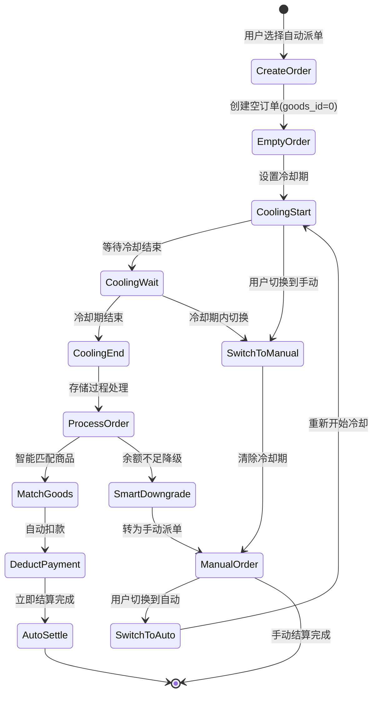

# 9color 自动派单冷却期实现机制详解

## 📋 文档概述

本文档详细解析9color项目中自动派单冷却期的完整实现机制，包括数据库设计、后端逻辑、定时任务、前端展示等各个层面的技术实现。

**更新时间：** 2025-07-02  
**版本：** v2.0 (统一派单方案)

## 🏗️ 整体架构

自动派单的冷却期机制是一个完整的**时间管理 + 状态流转 + 定时处理**系统，涉及前端、后端和数据库多个层面：

```
┌─────────────┐    ┌─────────────┐    ┌─────────────┐
│   前端展示   │    │  PHP后端    │    │   数据库    │
│            │    │            │    │            │
│ 冷却倒计时   │◄──►│ 状态管理    │◄──►│ 存储过程    │
│ 状态显示    │    │ 业务逻辑    │    │ 定时检查    │
│ 用户操作    │    │ 配置管理    │    │ 数据存储    │
└─────────────┘    └─────────────┘    └─────────────┘
       ▲                   ▲                   ▲
       │                   │                   │
       └───────────────────┼───────────────────┘
                           │
                  ┌─────────────┐
                  │  定时任务    │
                  │ Cron/事件   │
                  │ 自动触发    │
                  └─────────────┘
```

## 📊 数据库层面

### 1. 核心字段设计

#### xy_convey 订单表
```sql
`auto_dispatch` tinyint(1) DEFAULT NULL COMMENT '自动派单开关',
`cooling_end_time` int(11) DEFAULT '0' COMMENT '冷却期结束时间戳',  
`dispatch_status` tinyint(1) DEFAULT '0' COMMENT '派单状态: 0=冷却中, 1=已派单, 2=手动派单',
`manual_dispatch` tinyint(1) DEFAULT '0' COMMENT '手动派单标记',
`goods_id` int(11) DEFAULT '0' COMMENT '商品ID (0=空订单)',
`version` int(11) DEFAULT '0' COMMENT '乐观锁版本号'
```

#### 订单状态说明
| 状态组合 | auto_dispatch | manual_dispatch | goods_id | dispatch_status | 说明 |
|---------|---------------|-----------------|----------|----------------|------|
| **A状态** | 1 | 0 | 0 | 0 | 自动派单+无商品+冷却中 |
| **B状态** | 1 | 0 | >0 | 0 | 自动派单+有商品+冷却中 |
| **C状态** | 0 | 1 | 0 | 0 | 手动派单+无商品+等待匹配 |
| **D状态** | 0 | 1 | >0 | 2 | 手动派单+有商品+已付款 |

### 2. 配置表 (system_config)

```sql
INSERT INTO system_config (name, value) VALUES
('cooling_period_minutes', '1'),      -- 冷却期分钟数 (当前为1分钟)
('auto_dispatch_enabled', '1'),       -- 是否启用自动派单
('enable_smart_downgrade', '1');      -- 是否启用智能降级
```

### 3. 存储过程：ProcessAutoDispatchOrder

**文件位置：** `database-server/mysql/upgrade-unified-dispatch.sql`

#### 核心逻辑流程
```sql
-- 1. 只处理空订单
SELECT uid, version INTO v_user_id, v_version
FROM xy_convey 
WHERE id = order_id 
  AND auto_dispatch = 1 
  AND dispatch_status = 0 
  AND status = 0
  AND goods_id = 0  -- 核心：只处理空订单
FOR UPDATE;

-- 2. 智能商品匹配
SELECT id, goods_price 
INTO v_goods_id, v_goods_price
FROM xy_goods_list 
WHERE status = 1 
  AND goods_price <= v_balance 
  AND goods_price >= (v_balance * 0.1)  -- 最小使用10%余额
ORDER BY RAND() 
LIMIT 1;

-- 3. 完整事务：扣款 → 分配商品 → 立即结算
```

#### 智能降级机制
```sql
-- 余额不足时自动转为手动派单
IF v_enable_smart_downgrade = 1 THEN
    UPDATE xy_convey 
    SET auto_dispatch = 0, 
        manual_dispatch = 1,
        dispatch_status = 0,
        cooling_end_time = 0
    WHERE id = order_id;
END IF;
```

## 🔧 PHP后端层面

### 1. 冷却期配置获取

**文件：** `application/common.php`

```php
function get_dispatch_config($key, $default = null)
{
    static $dispatchConfig = null;
    
    if ($dispatchConfig === null) {
        // 从system_config表读取配置
        $systemConfig = \think\Db::name('system_config')->column('value', 'name');
        $dispatchConfig = [
            'cooling_period_minutes' => 1,  // 冷却期分钟数
            'auto_dispatch_enabled' => true,
            'enable_smart_downgrade' => true,
        ];
        
        // 合并数据库配置
        foreach ($dispatchConfig as $configKey => $defaultValue) {
            if (isset($systemConfig[$configKey])) {
                $dispatchConfig[$configKey] = $systemConfig[$configKey];
            }
        }
    }
    
    return isset($dispatchConfig[$key]) ? $dispatchConfig[$key] : $default;
}
```

### 2. 订单创建时的冷却期设置

**文件：** `application/admin/model/Convey.php`

```php
public function create_empty_order($uid, $cid, $isAutoDispatch = false)
{
    // 统一的空订单结构
    $orderData = [
        'goods_id' => 0,  // 空订单标记
        'dispatch_status' => 0,
        // ... 其他字段
    ];
    
    if ($isAutoDispatch) {
        // 自动派单：设置冷却期
        $coolingPeriod = get_dispatch_config('cooling_period_minutes', 1) * 60;
        $orderData['auto_dispatch'] = 1;
        $orderData['manual_dispatch'] = 0;
        $orderData['cooling_end_time'] = time() + $coolingPeriod;
        $orderData['endtime'] = time() + $coolingPeriod;
    } else {
        // 手动派单：无冷却期
        $orderData['auto_dispatch'] = 0;
        $orderData['manual_dispatch'] = 1;
        $orderData['cooling_end_time'] = 0;
    }
    
    return Db::name('xy_convey')->insert($orderData);
}
```

### 3. 冷却期检查与处理

```php
public function processCoolingOrders()
{
    // 查找冷却期结束的订单
    $orders = Db::name('xy_convey')
        ->where('auto_dispatch', 1)
        ->where('dispatch_status', 0)           // 冷却中
        ->where('cooling_end_time', '>', 0)     // 有冷却时间
        ->where('cooling_end_time', '<=', time()) // 已结束
        ->where('status', 0)                    // 待付款
        ->select();
        
    $processedCount = 0;
    $errors = [];
    
    foreach ($orders as $order) {
        try {
            // 调用存储过程处理
            Db::query("CALL ProcessAutoDispatchOrder(?)", [$order['id']]);
            $processedCount++;
        } catch (\Exception $e) {
            $errors[] = "订单 {$order['id']} 处理异常: " . $e->getMessage();
        }
    }
    
    return [
        'code' => 0,
        'processed_count' => $processedCount,
        'total_found' => count($orders),
        'errors' => $errors
    ];
}
```

### 4. 冷却期剩余时间计算

```php
public function getCoolingTimeLeft($orderId)
{
    $order = Db::name('xy_convey')->where('id', $orderId)->find();
    
    if (!$order || !$order['cooling_end_time']) {
        return 0;
    }
    
    $timeLeft = $order['cooling_end_time'] - time();
    return max(0, $timeLeft); // 返回剩余秒数
}
```

### 5. 派单模式切换时的冷却期处理

```php
// 手动切自动：设置新的冷却期
public function switchToAutoDispatch($orderId)
{
    $coolingPeriod = get_dispatch_config('cooling_period_minutes', 1) * 60;
    
    // 无商品的订单：保持空订单状态，等待冷却期结束后分配商品
    $updateData = [
        'auto_dispatch' => 1,
        'manual_dispatch' => 0,
        'dispatch_status' => 0, // 冷却中
        'cooling_end_time' => time() + $coolingPeriod
        // 不修改 goods_id，保持原有的 0 值
        // 不调用 autoAssignGoods()
    ];
    
    return Db::name('xy_convey')->where('id', $orderId)->update($updateData);
}

// 自动切手动：清除冷却期
public function switchToManualDispatch($orderId) 
{
    $updateData = [
        'auto_dispatch' => 0,
        'manual_dispatch' => 1,
        'dispatch_status' => 0,
        'cooling_end_time' => 0, // 清除冷却时间
        'goods_id' => null,      // 清除商品，重新匹配
        'num' => 0,              // 清除订单金额
        'commission' => 0        // 清除佣金
    ];
    
    return Db::name('xy_convey')->where('id', $orderId)->update($updateData);
}
```

## ⏰ 定时任务层面

### 1. Cron脚本

**文件：** `auto_dispatch_cron.sh`

```bash
#!/bin/bash
# 9Color自动派单定时任务脚本
# 每分钟执行一次，替代数据库事件调度器

LOG_FILE="/Users/josiahzhang/Repository/9color/logs/auto_dispatch.log"
mkdir -p "$(dirname "$LOG_FILE")"

echo "[$(date '+%Y-%m-%d %H:%M:%S')] 开始执行自动派单检查..." >> "$LOG_FILE"

# 调用PHP自动派单接口
RESULT=$(curl -s "http://localhost/index/crontab/auto_dispatch" 2>&1)

if [ $? -eq 0 ]; then
    echo "[$(date '+%Y-%m-%d %H:%M:%S')] 执行成功: $RESULT" >> "$LOG_FILE"
else
    echo "[$(date '+%Y-%m-%d %H:%M:%S')] 执行失败: $RESULT" >> "$LOG_FILE"
fi

# 保持日志文件大小，只保留最近1000行
tail -n 1000 "$LOG_FILE" > "$LOG_FILE.tmp" && mv "$LOG_FILE.tmp" "$LOG_FILE"
```

### 2. PHP定时接口

**文件：** `application/index/controller/Crontab.php`

```php
public function auto_dispatch()
{
    $conveyModel = new \app\admin\model\Convey();
    $result = $conveyModel->processCoolingOrders();
    
    return json([
        'code' => 0,
        'info' => "处理了 {$result['processed_count']} 个订单",
        'data' => $result
    ]);
}
```

### 3. 命令行任务

**文件：** `application/admin/command/ProcessDispatch.php`

```php
protected function execute(Input $input, Output $output)
{
    $conveyModel = new Convey();
    $result = $conveyModel->processCoolingOrders();
    
    $output->writeln("自动派单处理完成：");
    $output->writeln("- 找到订单：{$result['total_found']} 个");
    $output->writeln("- 处理成功：{$result['processed_count']} 个");
    $output->writeln("- 错误数量：" . count($result['errors']));
}
```

## 🖥️ 前端展示层面

### 1. 管理后台：自动检查冷却期

**文件：** `application/admin/view/deal/order_list.html`

```javascript
// 30秒定时检查
setInterval(function() {
    $.ajax({
        url: "/admin/deal/check_cooling_orders",
        type: 'POST',
        dataType: 'json',
        data: {
            '_csrf_': $('meta[name="csrf-token"]').attr('content')
        },
        success: function(result) {
            if (result.code === 0 && result.data.processed_count > 0) {
                console.log('自动派单处理完成:', result.info);
                // 有订单被处理，刷新页面显示最新状态
                setTimeout(function() {
                    location.reload();
                }, 2000);
            }
        },
        error: function() {
            console.log('自动派单检查失败');
        }
    });
}, 30000); // 30秒检查一次

// 页面可见性检查 - 当页面重新变为可见时立即检查
document.addEventListener('visibilitychange', function() {
    if (!document.hidden) {
        $.ajax({
            url: "/admin/deal/check_cooling_orders",
            type: 'POST',
            dataType: 'json',
            data: {
                '_csrf_': $('meta[name="csrf-token"]').attr('content')
            },
            success: function(result) {
                if (result.code === 0 && result.data.processed_count > 0) {
                    console.log('页面重新可见时检查到订单处理:', result.info);
                    location.reload();
                }
            }
        });
    }
});
```

### 2. 用户前端：冷却期状态显示

**文件：** `application/index/controller/Order.php`

```php
foreach ($data as &$datum) {
    // 添加订单状态描述，便于前端显示
    if ($datum['auto_dispatch'] == 1) {
        if ($datum['dispatch_status'] == 0) {
            $timeLeft = $datum['cooling_end_time'] - time();
            if ($timeLeft > 0) {
                $datum['status_desc'] = '冷却中 (' . ceil($timeLeft/60) . '分钟)';
            } else {
                $datum['status_desc'] = '冷却结束，待自动结算';
            }
        } elseif ($datum['dispatch_status'] == 1) {
            $datum['status_desc'] = '已完成（自动）';
        }
    } elseif ($datum['manual_dispatch'] == 1) {
        if ($datum['dispatch_status'] == 0) {
            $datum['status_desc'] = '等待匹配订单';
        } elseif ($datum['dispatch_status'] == 2) {
            $datum['status_desc'] = $datum['status'] == 0 ? '等待手动结算' : '已完成（手动）';
        }
    }
}
```

### 3. 通用倒计时组件

**文件：** `public/statics/js/hui.js`

```javascript
// 倒计时功能
_hui.countdown = function (timer, domId, showType) {
    hui.countdownBase(timer, domId, showType);
    setInterval(function () {
        hui.countdownBase(timer, domId, showType);
    }, 1000);
}

_hui.countdownBase = function (timer, domId, showType) {
    var leftTime = (new Date(timer)) - new Date();
    if (leftTime > 0) {
        var days = parseInt(leftTime / 1000 / 60 / 60 / 24, 10);
        var hours = parseInt(leftTime / 1000 / 60 / 60 % 24, 10);
        var minutes = parseInt(leftTime / 1000 / 60 % 60, 10);
        var seconds = parseInt(leftTime / 1000 % 60, 10);
    } else {
        var days = 0, hours = 0, minutes = 0, seconds = 0;
    }
    
    // 格式化显示时间
    var html = formatTime(days, hours, minutes, seconds, showType);
    hui(domId).html(html);
}
```

## 🔄 状态流转图



## 🎯 关键特性

### 1. 统一空订单机制
- **设计理念**：延迟决策，商品选择发生在冷却期结束时
- **实现方式**：自动派单和手动派单都创建 `goods_id=0` 的空订单
- **优势**：避免冷却期内商品变化导致的问题

### 2. 智能匹配算法
- **匹配逻辑**：根据用户当前余额动态选择商品
- **价格范围**：`10%余额 <= 商品价格 <= 100%余额`
- **随机选择**：在符合条件的商品中随机选择，增加公平性

### 3. 智能降级机制
- **触发条件**：用户余额不足以购买任何可用商品
- **处理方式**：自动转为手动派单模式
- **配置控制**：通过 `enable_smart_downgrade` 配置开关

### 4. 多重检查机制
- **定时任务**：Cron脚本每分钟自动检查
- **页面触发**：管理后台30秒检查一次
- **页面可见性**：浏览器重新可见时立即检查
- **手动触发**：管理员可手动触发检查

### 5. 并发安全保障
- **乐观锁**：使用 `version` 字段防止重复处理
- **数据库锁**：`FOR UPDATE` 确保原子性操作
- **事务管理**：完整的事务回滚机制

## 📋 当前配置

| 配置项 | 值 | 说明 | 文件位置 |
|-------|---|------|----------|
| `cooling_period_minutes` | `1` | 冷却期1分钟 | system_config表 |
| `auto_dispatch_enabled` | `1` | 启用自动派单 | system_config表 |
| `enable_smart_downgrade` | `1` | 启用智能降级 | system_config表 |

### 配置修改方法

#### 1. 数据库直接修改
```sql
-- 修改冷却期为5分钟
UPDATE system_config SET value = '5' WHERE name = 'cooling_period_minutes';

-- 禁用智能降级
UPDATE system_config SET value = '0' WHERE name = 'enable_smart_downgrade';
```

#### 2. 使用配置函数
```php
// 设置冷却期为3分钟
set_dispatch_config('cooling_period_minutes', 3);

// 获取当前冷却期配置
$coolingMinutes = get_dispatch_config('cooling_period_minutes', 1);
```

## 🔧 关键文件位置

### 核心业务文件
| 功能模块 | 文件路径 | 说明 |
|---------|----------|------|
| **核心模型** | `application/admin/model/Convey.php` | 订单管理和冷却期逻辑 |
| **配置函数** | `application/common.php` | 派单配置获取和设置 |
| **定时接口** | `application/index/controller/Crontab.php` | 定时任务PHP接口 |
| **管理控制器** | `application/admin/controller/Deal.php` | 管理后台订单操作 |

### 数据库文件
| 功能 | 文件路径 | 说明 |
|------|----------|------|
| **存储过程** | `database-server/mysql/upgrade-unified-dispatch.sql` | 最新的统一派单存储过程 |
| **初始化脚本** | `database-server/mysql/00-complete-init.sql` | 完整数据库初始化 |
| **修复脚本** | `database-server/mysql/fix-auto-dispatch-v2.sql` | 自动派单修复脚本 |

### 前端文件
| 功能 | 文件路径 | 说明 |
|------|----------|------|
| **管理后台列表** | `application/admin/view/deal/order_list.html` | 订单列表页面 |
| **用户订单页** | `application/index/controller/Order.php` | 用户订单控制器 |
| **倒计时组件** | `public/statics/js/hui.js` | 通用JavaScript组件 |

### 定时任务文件
| 功能 | 文件路径 | 说明 |
|------|----------|------|
| **Cron脚本** | `auto_dispatch_cron.sh` | Linux定时任务脚本 |
| **命令行工具** | `application/admin/command/ProcessDispatch.php` | ThinkPHP命令行工具 |

## 🚀 性能优化建议

### 1. 数据库优化
```sql
-- 为冷却期查询添加索引
CREATE INDEX idx_cooling_check ON xy_convey(auto_dispatch, dispatch_status, cooling_end_time, status);

-- 为状态查询添加复合索引
CREATE INDEX idx_dispatch_status ON xy_convey(auto_dispatch, manual_dispatch, goods_id, status);
```

### 2. 缓存优化
```php
// 使用Redis缓存配置
$redis = new Redis();
$coolingPeriod = $redis->get('dispatch_config:cooling_period_minutes');
if (!$coolingPeriod) {
    $coolingPeriod = get_dispatch_config('cooling_period_minutes', 1);
    $redis->setex('dispatch_config:cooling_period_minutes', 300, $coolingPeriod); // 5分钟缓存
}
```

### 3. 批量处理优化
```php
// 批量处理冷却期结束的订单
public function processCoolingOrdersBatch($batchSize = 50)
{
    $orders = Db::name('xy_convey')
        ->where('auto_dispatch', 1)
        ->where('dispatch_status', 0)
        ->where('cooling_end_time', '<=', time())
        ->limit($batchSize)
        ->select();
        
    // 批量调用存储过程
    // ...
}
```

## 🔍 故障排查指南

### 1. 冷却期不生效
**可能原因：**
- 配置获取失败
- 时间戳计算错误
- 定时任务未运行

**排查步骤：**
```php
// 检查配置
$config = get_dispatch_config('cooling_period_minutes', 1);
echo "冷却期配置: {$config} 分钟\n";

// 检查订单状态
$order = Db::name('xy_convey')->where('id', $orderId)->find();
echo "冷却结束时间: " . date('Y-m-d H:i:s', $order['cooling_end_time']) . "\n";
echo "当前时间: " . date('Y-m-d H:i:s') . "\n";
```

### 2. 自动派单不执行
**可能原因：**
- 存储过程执行失败
- 并发锁冲突
- 数据不一致

**排查步骤：**
```sql
-- 检查待处理订单
SELECT COUNT(*) FROM xy_convey 
WHERE auto_dispatch = 1 
  AND dispatch_status = 0 
  AND cooling_end_time <= UNIX_TIMESTAMP() 
  AND status = 0;

-- 检查自动派单日志
SELECT * FROM xy_auto_dispatch_log 
WHERE create_time >= UNIX_TIMESTAMP() - 3600 
ORDER BY create_time DESC;
```

### 3. 状态显示异常
**可能原因：**
- 前端缓存问题
- 状态计算错误
- 时区问题

**排查步骤：**
```javascript
// 检查前端状态计算
console.log('订单数据:', orderData);
console.log('冷却结束时间:', new Date(orderData.cooling_end_time * 1000));
console.log('当前时间:', new Date());
```

## 📝 更新日志

### v2.0 (2025-07-02)
- ✅ 实现统一派单方案
- ✅ 新增智能降级机制
- ✅ 优化存储过程性能
- ✅ 完善并发安全机制

### v1.1 (2025-06-25)
- ✅ 修复重复扣款问题
- ✅ 优化冷却期检查逻辑
- ✅ 增加自动派单日志

### v1.0 (2025-06-20)
- ✅ 初始冷却期机制实现
- ✅ 基础定时任务框架
- ✅ 前端状态显示

---

**文档维护：** 开发团队  
**最后更新：** 2025-07-02 15:30:00  
**版本：** v2.0 